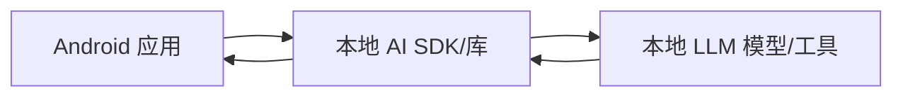
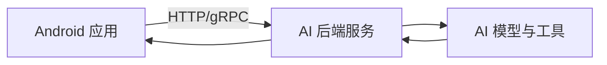
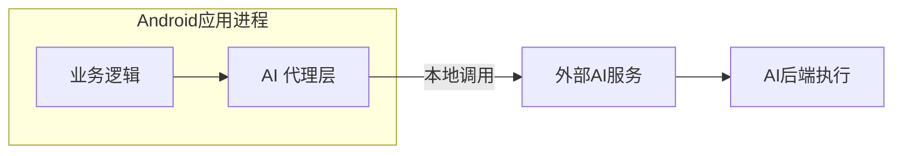
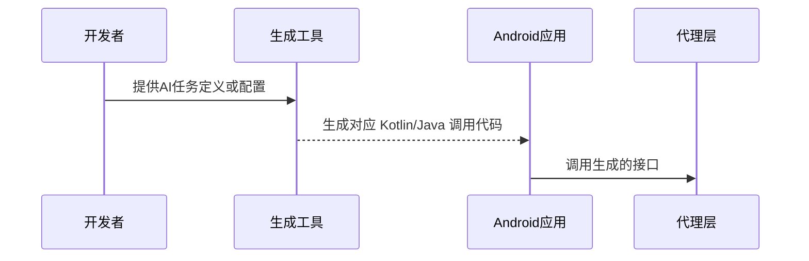
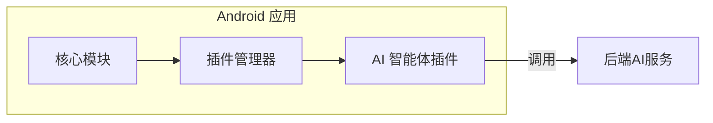

# 执行摘要

本报告针对如何将现有 AI 智能体工具（例如 Claude Agent SDK、LangGraph、DeerFlow 等）集成到 **Google Agent Development Kit (ADK)** 项目中进行全面分析。我们从目标与范围、工具概览、兼容性评估、集成模式、实施细节、开发运维影响、法律合规等维度展开研究，并给出多种可行方案和交付物建议。报告以中文撰写，引用了 ADK 官方文档和各工具官方资料【50†L204-L212】【58†L108-L110】【60†L99-L107】【61†L350-L358】【26†L82-L89】【39†L43-L46】【46†L7-L10】等，以保证信息准确可追溯。全文结构清晰，包含必要的架构图（mermaid）、对比表格与时间线，力求提供工程和产品团队所需的技术深度与细节。

## 假设清单

- **Google ADK 版本**：未指定（假设采用最新稳定版本）。  
- **目标平台**：未指定（可假定为 Android 平台）。  
- **首选语言**：未指定（默认 Kotlin/Java 优先）。  
- **AI 工具范围**：除题中提及的 Claude Agent SDK、LangGraph、DeerFlow、AutoGen、LangChain、RAGFlow 外，还考虑包括 MetaGPT、AutoGPT、LlamaIndex 等新兴工具，文中将说明纳入或排除理由。  
- **部署环境**：未指定（可选用云端或本地服务器，或混合模式）。  

## 目标与范围

**Google Agent Development Kit (ADK)** 是 Google 推出的开源框架，用于开发和部署 AI 代理【50†L204-L212】。ADK 框架高度模块化，面向软件工程理念设计，支持多种模型和部署场景，被广泛用于构建“代理化”应用程序。虽然 ADK 优化了 Google 自有的 Gemini 模型生态，但它是**模型无关、部署无关**的，可兼容其他智能体框架【50†L204-L212】。报告假设目标 ADK 版本未明确（使用最新版本），目标平台默认为 Android 或通用应用环境。我们分析将包括如何让上述 AI 工具在 ADK 项目中**复用其特性**，并满足性能、开发效率和合规等需求。

## 工具清单

本文所选工具及其概述如下（含功能、独特点、架构组成、依赖与许可）：

- **Claude Agent SDK (Anthropic)**：由 Anthropic 提供的智能体开发套件，用于构建自主代理。支持 Python 和 TypeScript，两者均可调用 Claude Code 模型进行推理【58†L108-L110】。核心功能包括**文件读写、代码编辑、Bash 命令执行、网络搜索**等内置工具，让智能体自动化完成各种任务【58†L218-L226】【58†L237-L245】。架构包含代理循环（Agent Loop）、工具执行引擎、钩子(Hooks)、子智能体(Subagents)、模型上下文协议(MCP) 适配器等组件【58†L218-L226】。开发依赖 Python 3.9+ 或 Node.js 环境，需要配置 Anthropic API Key，可通过 Vertex AI/Azure 等后端适配。授权使用受 Anthropic 商业条款约束（并非开源）【58†L108-L110】【58†L218-L226】。*独特卖点：* 集成了一套成熟的 Autonomy 工具，能快速构建文件/代码操作智能体。

- **LangGraph (LangChain Inc.)**：LangChain 推出的开源长流程智能体工作流编排框架。它采用**有向图（Graph）+ 状态机**架构，用于定义和执行复杂的长期运行、多状态的任务流程【60†L99-L107】。核心模块包括可持久化执行的 StateGraph、图 API、函数式编程接口，以及内置的代理(Agent)、监督(Supervisor)、群体(Swarm)等。LangGraph 提供**持久执行**（失败自动恢复）、**人机协同**（执行中可人工干预）、**全面记忆**（短期和长期记忆）、**调试可视化**（通过 LangSmith 跟踪执行轨迹）和**生产级部署**等优势【60†L99-L107】。框架使用 Python 3.10+ 开发，依赖网络通信库及持久化数据库，授权为 MIT【60†L99-L107】。*独特卖点：* 专注于可监控的企业级智能体，适合可靠性要求高的长期任务。

- **DeerFlow (ByteDance)**：字节跳动开源的“深度探索”智能体框架。DeerFlow 全称 Deep Exploration and Efficient Research Flow，是一个**超级协调智能体( SuperAgent )**系统，能够编排多个子智能体协作完成复杂任务【61†L350-L358】。其架构包括**任务协调者(Coordinator)**、**计划者(Planner)**、**报告者(Reporter)**以及隔离执行沙盒(Sandbox)等组件，通过可扩展的“技能(Skill)”模块驱动任务执行。DeerFlow 兼容 Claude Code 等插件，支持对话、检索和代码生成等功能。主要依赖有 Docker、Python 运行环境及深度学习模型服务器，支持多种模型后端(包括本地和云端)。项目采用 MIT 许可【61†L342-L343】【61†L350-L358】。*独特卖点：* 强调多智能体协作和安全沙盒执行，能够处理分钟到小时级别的长任务。

- **AutoGen (Microsoft Research)**：微软研究院的开源多智能体框架。AutoGen 采用异步消息驱动的架构，定义了用户代理(User Agent)、助理代理(Assistant Agent)、协调者代理(Coordinator Agent) 等角色，用于模拟多角色协作【26†L82-L89】。其特性包括异步消息传递、模块化设计、丰富的监控与可视化支持、分布式执行和跨语言扩展【26†L82-L89】。开发者可编写脚本配置各种子代理及其交互规则，AutoGen 会自动安排通信和任务分工。依赖 Python 3.10+，可选用 Azure 或本地计算资源，项目使用 MIT 许可证【26†L82-L89】。*独特卖点：* 强调智能体间的可观察性（自动跟踪决策和对话历史）和高可扩展性，适合需要精细监控的多步骤任务。

- **LangChain**：流行的开源 LLM 应用框架，由 Harrison Chase 开创。LangChain 将应用逻辑拆分为**链(Chain)**、**提示模板(Prompt Template)**、**检索器(Retriever)**、**记忆(Memory)**、**工具(Toolkit)**等模块【39†L43-L46】【39†L65-L68】。开发者可通过这些组件组合各种功能，如对话、问答、内容生成等，而不需手动处理底层 API。LangChain 支持接入多种 LLM（包括 OpenAI、Bard、其他开源模型）和数据库/向量库，实现 RAG (检索增强生成)等。其架构灵活开放，提供 Python SDK（Apache-2.0 许可【41†L3-L6】）。*独特卖点：* 丰富的生态和集成能力，拥有大量预构建模块，可加快开发流程和原型验证。

- **RAGFlow (InfiniFlow)**：开源的检索增强生成 (RAG) 平台和智能体框架。RAGFlow 将文档存储、检索和大模型推理集成，通过 ETL 管道、向量索引(ElasticSearch/Infinity)、以及 LLM 模型提供端到端服务。它支持文档批注、问答系统和代理执行等应用，允许用户构建和管理复杂的知识库环境。RAGFlow 带有任务调度和 Web UI，适合企业级部署。该项目采用 Apache-2.0 许可证【46†L7-L10】。*独特卖点：* “一站式” RAG 解决方案，深度结合知识检索和 AI 代理，能够显著提高对话上下文的准确性。

- **MetaGPT**：由 FoundationAgents 组织开发的多智能体协作框架。MetaGPT 将复杂任务分配给不同角色的 GPT（如产品经理、开发者等），模拟完整的软件公司流程，自动生成需求文档、架构设计、代码等【53†L345-L353】。该项目采用 MIT 许可证【53†L309-L317】。*纳入理由：* 强调多角色协作的开源框架，具备创新的流程管理思路，可作为参考案例。

- **Auto-GPT**：知名的开源“自主GPT”项目，旨在让 GPT 自动完成多步任务。它定义了简单用户输入后，自动调用多轮 GPT 查询并执行外部命令（依赖 OpenAI API）来完成目标。许可采用非商用限制较多的 PolyForm（Shield）许可证【54†L0-L3】。*说明：* Auto-GPT 本身属于实验性项目，且许可限制其商用使用，因此不宜直接集成到商业项目，仅作为案例讨论。

- **LlamaIndex (GPTIndex)**：数据编排与检索框架，用于将外部数据（文本、文档、数据库）连接到 LLM 的上下文窗口。LlamaIndex 提供 Python/TS 实现，可快速构建 RAG 管道【55†L12-L14】。其功能包含数据加载、索引创建、查询等，简化了知识库驱动的对话系统开发。项目许可为 MIT。*纳入理由：* 在 RAG 场景中，与 LangChain 类似，LlamaIndex 可用于知识增强，具有参考价值。

各工具的对比可见下表（部分内容）：  

| 工具           | 主要功能                    | 架构组件           | 依赖平台/语言            | 许可            |
|--------------|---------------------------|------------------|---------------------|---------------|
| Claude Agent SDK | 文件读写、代码编辑、命令执行等工具 | 代理循环、内置工具、钩子、子代理 | Python3/TS + Claude Cloud API | 商业授权【58†L108-L110】【58†L218-L226】 |
| LangGraph    | 有状态流程编排、持久执行、人机协同 | StateGraph、Graph API、LangSmith 等 | Python3.10+           | MIT【60†L99-L107】 |
| DeerFlow     | 多智能体协调、沙盒执行、技能库  | 协调者、规划者、报告者、沙盒、技能 | Docker + Python、模型库 | MIT【61†L350-L358】【61†L342-L343】 |
| AutoGen      | 多角色异步代理、扩展性强        | 用户/助理/协调者 角色、消息总线   | Python3.10+           | MIT【26†L82-L89】    |
| LangChain    | LLM 链接、提示模板、检索器     | Chains、Prompts、Tools、Memory | Python3 + 各类 LLM API  | Apache-2.0【41†L3-L6】 |
| RAGFlow      | 文档索引检索、RAG 对话        | 索引器、检索器、模型推理引擎 | Python3 + Elasticsearch | Apache-2.0【46†L7-L10】 |
| MetaGPT      | 多角色智能体协作、软件公司流程  | GPT 角色（PM、架构师等）、SOP | Python3 + Node.js    | MIT【53†L309-L317】   |
| Auto-GPT     | 自主执行多步骤任务           | GPT 循环调用      | Python3 + OpenAI API | PolyForm Shield (限非商用)【54†L0-L3】 |
| LlamaIndex   | 知识库数据索引与查询         | 索引器、查询接口   | Python3/TypeScript    | MIT【55†L12-L14】   |

## 兼容性分析

针对上述工具，我们从 Google ADK 项目角度逐一评估其集成契合度：

- **Claude Agent SDK**：原生支持 Python/TypeScript【58†L108-L110】，无 Java/Kotlin 库。对于 ADK 项目（假设 Java/Kotlin），常用做法是以**微服务**方式集成：在服务器上部署 Agent 服务，Android 端通过 HTTP/gRPC 调用。这种模式下，数据流为客户端发出请求、后端执行智能体处理并返回结果。事件模型需异步处理（避免阻塞主线程）。性能上，服务器端承担模型推理和工具调用，Android 仅进行网络通信，CPU/内存压力主要在后端；缺点是网络延迟和带宽影响响应速度。安全与隐私风险体现在用户输入需发送到云端，需加密传输并合规处理（符合个人信息保护要求）。许可方面，Claude Agent SDK 属商业产品，需要遵守 Anthropic 商业条款【58†L108-L110】；可能存在限制跨境使用（需检查服务地区协议）。

- **LangGraph**：基于 Python，主要用于编排长期有状态工作流【60†L99-L107】。无法直接在 Android 端运行。集成同样依赖后端服务（或边车进程）。ADK 端调用时，只需调用后端接口，后端运行 LangGraph 节点执行。数据流为任务定义和参数在客户端与服务端之间传递，事件流可基于回调或轮询实现。性能影响：后端长期运行任务可能占用资源，客户端加载调度结果开销可控制。安全风险：与普通后端服务类似，但 LangGraph 强调人机协作，可在客户端引入人审步骤。许可 MIT 无冲突，对接顺畅。总体兼容性：可作为后端工作流引擎，Android 端可通过其 API/REST 调用。

- **DeerFlow**：体系庞大，由多服务组成，核心代码基于 Python/Node。集成方式仍以微服务为主：在云端或本地服务器部署 DeerFlow，Android 端充当控制终端。数据流涉及多个子代理的信息流转，客户端可下发任务指令，并接收最终报告。性能方面，DeerFlow 任务可耗时较长（数分钟至数小时），需合适的会话管理和超时策略；Android 端运行开销小。隐私风险：需将任务细节和用户数据上传，需脱敏和权限控制。MIT 许可【61†L342-L343】允许商用。兼容性较高但需专门部署环境，不适合作为嵌入式 SDK。

- **AutoGen**：支持 Python 和 .NET，多智能体消息架构【26†L82-L89】。与前述类似，Android 端难以原生使用，需要云端部署服务。数据流是异步消息往返，Android 端可作为用户输入前端与结果接收端。资源影响：AutoGen 可扩展成集群，客户端负担极小。安全与隐私：通信加密、授权验证等基本要求应实现。MIT 许可无问题【26†L82-L89】。兼容性：同样以服务形式居多，也可借助 A2A 协议等机制与 ADK Agent 通信。

- **LangChain**：纯 Python 框架，本身无 Android 库。多用于构建交互式对话、检索等。集成模式可为后端服务，Android 发起请求调用链上的功能（或直接用 LangChain 的 LL M API 功能）。数据流：典型为用户查询→链式组件处理(检索/LLM)→输出。性能：后端依赖 LLM 调用，可通过缓存和向量数据库加速，客户端影响低。隐私：可能需访问外部知识库，需审慎控制数据访问。Apache 许可无问题。兼容性较好，但建议作为后端引擎或配合 ADK 的 Memory/Tool 管道使用。

- **RAGFlow**：企业级系统，依赖 Elasticsearch/Redis 等组件，主要在服务器端运行。Android 端只能通过其 API/GraphQL 接口获取服务（如查询知识库、触发检索会话）。数据流为标准 RAG：客户端输入问题→后端检索相关文档+生成回答→返回给客户端。性能：后端索引和检索开销较大，但可并行扩容；客户端仅做输入输出。隐私：企业知识库访问需授权，注意合规；Apache 2.0 许可【46†L7-L10】兼容。兼容性高，但适合做为云端知识图层服务。

- **MetaGPT**：纯 Python 框架，用于多角色 GPT 协作。无官方移动库，只能部署为后端微服务或 CLI 工具，客户端扮演触发器角色。数据流：用户命令→MetaGPT 生成多文件/文档等资源→客户端获取结构化结果。性能：更多侧重于离线生成，大规模操作较耗时；客户端只是命令行控制。隐私：与一般后端相同（使用 OpenAI/Gemini API 时需注意数据安全）。MIT 许可，无兼容性障碍。纳入意义在于提供复杂任务自动化的思路。

- **Auto-GPT**：非商业许可证限制的项目，只是示例。兼容性差，不建议在产品中直接使用，仅作参考。

- **LlamaIndex**：Python/TypeScript 框架，专注 RAG 数据管理【55†L12-L14】。可作为后端服务或库使用，也支持用 Python 嵌入到服务器进程。Android 端调用与 LangChain 相似，通过后端 API 提供检索服务。性能：数据索引主要在后端，客户端影响小。隐私：作为知识库检索工具，需关注数据存储合规。MIT 许可，与现有栈兼容。

总体而言，这些工具大多数**无法直接嵌入 Android**，需通过微服务或代理层形式集成。各自的数据流与事件模型亦类似：Android 端作为前端界面，后端工具负责实际 AI 推理和存储。主要性能影响在后端服务器资源与网络延迟。安全与隐私需通过加密通道和数据审计保障，许可冲突较少（多数为 MIT/Apache；唯有 Claude Agent SDK 商业限制最严格）。

## 集成模式

本文提出如下集成模式，每种模式附架构图、优缺点及场景分析：

#### 模式1：嵌入式 SDK 集成



**描述**：直接将 AI 工具库嵌入应用（例如使用 JNI/NDK 引入 C++ 模型库，或用 Chaquopy 内嵌 Python 环境）。应用通过 SDK 接口调用智能体功能，所有计算在设备端完成。

**优点**：
- **低延迟**：本地运行，无需网络，可实现毫秒级响应。
- **离线可用**：适合没有网络场景，增强用户隐私安全。
- **减少外部依赖**：无需服务器部署，开发部署集中。

**缺点**：
- **体积增大**：本地集成大型模型或 Python 解释器会显著增加 APK 大小（可能上百 MB）。
- **开发复杂**：需要交叉编译环境，解决库兼容性（例如移动端 GPU 支持有限）。
- **性能受限**：移动 CPU/GPU 能力远逊于服务器，运行大型模型时响应慢或耗电。
- **技术挑战**：一些工具（如 Claude SDK）没有 Android 平台库，需自行移植或寻找等效方案。

**适用场景**：对响应延迟和离线需求严格，且智能模型较小的场景。例如设备端的语言助手、图像识别等。可使用小型本地模型和简化的规则工具。

**难度与风险**：高。需处理多语言环境和资源优化。风险在于**兼容性问题**（设备不同、Android 版本差异）和**安全**（本地存储模型数据时加密保护）。*缓解*：剥离非核心功能，使用轻量化模型（如 TensorFlow Lite）；懒加载模块；严格加固本地存储和内存安全。

#### 模式2：微服务/边车模式



**描述**：将 AI 功能部署为独立的微服务，应用通过网络 API 调用。微服务可以部署在云端或本地服务器，负责运行智能体框架。

**优点**：
- **扩展性强**：后端资源可动态扩容，支撑大模型和高并发。
- **易开发**：使用熟悉的服务器语言和工具链，更容易调试和维护。
- **集中管理**：后端统一升级、日志监控，客户端无需更新即可获得新功能。
- **安全隔离**：敏感逻辑和数据保留在服务器端，客户端仅发送请求。

**缺点**：
- **网络依赖**：必须联网使用，延迟由网络和服务器响应共同决定，可能不适合实时场景。
- **运维成本**：需管理服务器、负载均衡、弹性伸缩等基础设施。
- **授权成本**：如果使用云端服务，如 Claude API ，可能产生成本。

**适用场景**：模型规模大、需要快速迭代、或团队已有云环境的情况。适合复杂问答系统、多轮对话助手等业务。

**难度与风险**：中等。需实现稳定的 API 接口和错误重试机制。风险主要是**网络故障**和**后端服务宕机**。*缓解*：在客户端实现请求超时和降级逻辑；在服务器端使用容错设计（如多实例、健康检查）；确保数据加密传输（HTTPS）并遵循 GDPR/隐私法规。

#### 模式3：代理层服务



**描述**：在应用内部增加一层“代理”模块（如 Singleton 类或中间服务），统一封装对各种 AI 工具的调用细节。业务代码通过该代理接口访问 AI 能力，代理层负责负载平衡、参数整理和调用后端服务。

**优点**：
- **解耦清晰**：业务逻辑与 AI 接口分离，便于统一维护和测试。
- **灵活切换**：可在代理层集中替换后端服务（例如将 Claude 改用 LangChain），对业务层透明。
- **统一安全与日志**：代理层可统一实现身份验证、参数校验和调用审计。

**缺点**：
- **增加间接层**：调用链条多了一级，稍微增加了调用延时和实现复杂度。
- **开发成本**：需要设计通用接口和适配多种服务的适配器。

**适用场景**：项目需要同时使用多种 AI 后端，或存在严格的安全/审计要求。适合初始阶段对接多个原型工具后再稳定最终方案的情况。

**难度与风险**：中低。开发时需定义稳定的接口契约。风险在于**接口设计缺陷**导致业务和代理层耦合紧密。*缓解*：制定明确协议（如 JSON Schema）、集成契约测试；并实现熔断和限流机制，避免异常传播。

#### 模式4：编译时/代码生成集成



**描述**：在构建期间，通过代码生成器将智能体配置或 DSL 转换为 Android 应用代码（例如通过注解处理、Gradle 插件）。应用无需手写重复的调用逻辑，只需使用生成的接口。

**优点**：
- **开发效率高**：自动生成重复调用样板，减少手工编码错误，提高一致性。
- **接口统一**：生成器可确保不同功能模块接口风格统一，便于维护。
- **抽象升级**：可将复杂逻辑封装在生成器内部，开发者只关注业务需求描述。

**缺点**：
- **灵活性受限**：一旦生成策略固定，修改需求需调整生成规则并重新编译。
- **调试复杂**：错误需在生成的代码中定位，增加理解难度。
- **构建复杂**：需要维护生成器工具链，增加构建时间。

**适用场景**：对智能体交互有固定模板或协议的应用。例如已经确定了调用哪类工具，生成对应适配器代码。适合团队愿意投入初期构建工具但追求后期一致性的项目。

**难度与风险**：中等。实现需要开发或定制代码生成器，可能使用 Kotlin Symbol Processing (KSP) 或注解处理器。风险在于生成器缺陷导致整个应用逻辑异常。*缓解*：生成器需有单元测试与版本控制；可临时使用手写接口做回退；在编译过程严格校验生成结果。

#### 模式5：运行时插件架构



**描述**：设计可插拔架构，将 AI 功能打包为可动态加载的插件（如 Android 动态 Feature Module、外部库、或通过 WebView 加载 JS 插件）。应用启动后，根据配置加载对应插件模块，插件内部封装对后端的调用和处理逻辑。

**优点**：
- **侵入性低**：业务核心无需耦合具体 AI 代码，只需通过插件接口扩展功能。
- **灵活升级**：可独立更新插件（OTA 或热更新），不必重新发布整个应用。
- **按需加载**：未使用的 AI 功能插件无需安装，可减小应用基础包体积。

**缺点**：
- **环境依赖**：需要 Android 支持动态加载（DexClassLoader、动态 module 等），实现较复杂。
- **版本管理**：插件和主程序需兼容管理，升级不当可能出现冲突。
- **调试难度**：动态加载后，代码追踪和日志会分散到不同模块。

**适用场景**：功能模块多变、更新频繁、或出于合规需分开发行的场景。例如需要在运行时决定使用哪种智能体实现的应用。

**难度与风险**：高。需要设计插件接口和加载机制。风险包括**插件注入攻击**、**加载失败崩溃**等。*缓解*：对插件进行签名校验；在插件框架中加入错误捕获和回退方案；对插件接口进行稳定性测试，保证兼容性。

## 实施细节

为支持上述模式，应执行以下关键步骤并进行测试：

- **集成库与依赖**：根据模式在项目中引入相应 SDK 或客户端库。例如在 Android Gradle 文件中添加所需依赖，或在微服务中安装 Python/Node 包。可采用 *Gradle/Kotlin DSL*（Android）或 *pip/conda + Docker*（服务端）的方式管理依赖。确保依赖版本锁定，并在 CI 中测试环境一致性。

- **示例代码片段**：  
  - *嵌入式模式*：如引入 Chaquopy 在 Android 项目运行 Python，通过以下伪代码调用：  
    ```kotlin
    Chaquopy.getPython().let { py ->
        val claude = py.getModule("claude_agent_sdk")
        val result = claude.callAttr("query", "列出当前目录文件")
        println("Result: ${result.toString()}")
    }
    ```  
  - *微服务模式*：在 Android 侧使用 Retrofit 调用后端：  
    ```kotlin
    interface ApiService {
        @POST("agent/query")
        suspend fun queryAI(@Body req: QueryRequest): QueryResponse
    }
    // 使用示例
    val response = apiService.queryAI(QueryRequest("写一个笑话"))
    textView.text = response.answer
    ```  
  - *代理层*：定义 `AIManager` 负责路由，如：  
    ```kotlin
    object AIManager {
        private val service = /* 初始化 Retrofit 等 */
        suspend fun ask(question: String): String {
            return try {
                val res = service.queryAI(QueryRequest(question))
                res.answer
            } catch (e: Exception) {
                "服务不可用，请稍后重试"
            }
        }
    }
    // 业务层调用
    val answer = AIManager.ask("用中文介绍ADK")
    ```  
  - *代码生成*：使用注解或 Gradle 插件生成接口，可参考 Kotlin Symbol Processing (KSP) 生成示例代码骨架。生成后直接在业务逻辑中调用：  
    ```kotlin
    // 由编译器生成
    val agent = GeneratedAgent()
    val reply = agent.ask("完成会议纪要")
    ```  
  - *插件架构*：例如使用 DexClassLoader 加载外部 Jar：  
    ```kotlin
    val jarPath = "/sdcard/ai-plugin.jar"
    val loader = DexClassLoader(jarPath, cacheDir.path, null, classLoader)
    val cls = loader.loadClass("com.example.plugin.AIPluginImpl")
    val plugin = cls.getDeclaredConstructor().newInstance() as AIPluginInterface
    val res = plugin.invoke("分析日志文件")
    ```

- **测试与验证方案**：  
  - *单元测试*：为每种模式编写测试用例。例如模拟后端返回，验证代理层或生成代码是否正确解析响应。  
  - *集成测试*：搭建完整环境（本地或 CI 执行微服务/插件加载），执行端到端请求；使用测试框架（JUnit/KotlinTest）自动化运行。  
  - *性能基准*：制定基准测试指标，如 **响应延迟** (建议目标<500ms)、**吞吐量**（TPS）、**内存/CPU 使用**。可用 Android Profiler 和服务器端 APM 工具（如 Prometheus）进行监控，并对比在不同模式下的性能差异。  
  - *异常与回退*：模拟网络中断、后端故障等场景，验证客户端是否能够优雅降级（如返回默认响应或从备份模型生成简易答案）。实施超时控制和重试逻辑，保证用户体验。  
  - *安全测试*：检查敏感信息是否被加密传输，测试是否存在代码注入或越权调用风险（特别是在插件和脚本执行场景下）。

- **监控策略**：部署监控以跟踪关键指标：错误率、延迟、资源使用。可利用 Grafana/Prometheus 或 Google Cloud Monitoring。定制仪表盘显示如 API 调用次数、处理时间分布、内存占用等。设置报警规则，当延迟或失败率超阈值时通知团队。

## 开发与运维影响

- **开发流程**：集成多种 SDK/工具会带来多语言（Java/Kotlin、Python、JavaScript）开发，要求团队具备跨栈能力。建议使用微模块化结构，将 AI 集成逻辑与核心功能隔离，以便并行开发。ADK 项目可分为**移动端模块**和**后台服务模块**，分别由不同团队负责。

- **CI/CD 流程**：需要为不同语言环境配置 CI。例如：  
  - Android 端 pipeline（Gradle 构建、单元测试、APK 打包）。  
  - 服务端 pipeline（Python 环境配置、Docker 构建、集成测试）。  
  集成测试可在 CI 中运行编排方案，例如使用 Docker Compose 启动后端服务并执行端到端测试。持续集成时，确保自动生成代码步骤被触发（若采用代码生成）。

- **版本与依赖管理**：前后端库依赖需锁定版本，防止破坏性升级。使用 `requirements.txt`、`package.json` 管理服务端依赖，Android 端使用 Gradle 配置。对各工具的版本更新需要回归测试，确保与 ADK 接口兼容。若采用代理层，可在其中统一版本控制工具的更新频率。

- **打包体积**：嵌入式模式会显著增加 APK 体积；建议仅保留必要功能模块，不使用时分离组件。例如将模型和大型库放在可下载的 Feature Module 或采用 Google Play 动态交付。微服务/代理模式对 APK 体积影响较小，主要增加网络库依赖（如 OkHttp）。

- **应用/Agent 启动时间**：附加的 SDK 或动态库可能延长冷启动时间。优化办法包括：按需初始化（首次调用时再加载模型）、使用异步启动，不阻塞 UI。对于插件架构，可延迟加载插件文件。减少不必要初始化也能缩短启动时延。

- **优化建议**：  
  - 使用 ProGuard/R8 混淆和瘦身，去除未用类。  
  - 在后台进程加载大型组件，前台只保留简易体验。  
  - 对网络调用使用压缩和批量处理，降低流量开销。  
  - 在微服务端使用 GPU 加速（若可用），提高推理效率。  

## 法律与合规

- **许可合规**：检查所用库的许可证。多数提及工具（LangGraph、DeerFlow、AutoGen、MetaGPT、LlamaIndex 等）均为 MIT 或 Apache-2.0 许可，允许商业用途，并可与闭源项目混用【60†L99-L107】【61†L350-L358】；只有 Claude Agent SDK 使用商业条款【58†L108-L110】，AutoGPT 等为非自由许可证。需确保遵守各开源许可证要求（如保留版权声明）。

- **数据隐私与出境**：根据我国《个人信息保护法》、《数据安全法》，敏感个人数据跨境传输需合规审查【48†L3-L7】。若代理调用云端（如 Google/Anthropic/其他国外服务），需遵循数据最小化原则，仅上传必要内容，且在应用层提示用户隐私风险。商业使用外部 API 时注意厂商条款（如限制内容类型）。

- **第三方服务条款**：集成外部 API（Claude、OpenAI、Google Gemini 等）时，需遵守其服务条款和请求配额限制【58†L108-L110】。避免使用未授权登录或爬虫方式调用模型。

- **安全风险**：允许运行代码工具（如 Bash、编辑器）会带来执行危险。应采用沙盒机制或明确权限控制，避免被恶意输入滥用。开发环境和生产环境应分离，测试时不要使用真实敏感数据。

- **合规建议**：制定隐私策略，对用户数据加密存储并定期清理日志。对于可能出境的数据流，评估是否需要认证（如《数据出境安全评估办法》）。与法律团队合作完成合规审计，并将合规要求纳入设计文档。

## 推荐方案

结合不同优先级，提出三套方案：

1. **方案A（性能优先）**：**本地化 AI 模型嵌入**  
   - 将部分关键模型和推理逻辑部署在设备端（可能利用设备专用加速器，如 Edge TPU），以最大限度减少网络延迟。集成轻量化 Agent SDK，实现离线小范围智能体功能。  
   - *工作量*: 约 **4 人·月**；  
   - *关键里程碑*: (1) 选型与测试轻量模型 (2 周)、(2) 集成 SDK 和工具链 (6 周)、(3) 性能调优和兼容性测试 (4 周)、(4) 容错和离线支持验证 (2 周)。  
   - *验收标准*: 本地调用响应<300ms，应用启动后智能体功能初始化时间<2s，离线模式可用。  

2. **方案B（开发效率优先）**：**云端代理 + 自动化流水线**  
   - 所有 AI 功能均采用微服务方式部署，Android 端通过代理层统一访问。并行开发前端和后端，充分利用现有云资源和基础设施。着重自动化测试与 CI/CD，快速迭代。  
   - *工作量*: 约 **3 人·月**；  
   - *关键里程碑*: (1) 设计 API 接口和代理层框架 (2 周)、(2) 后端微服务开发 (4 周)、(3) 前端集成与联调 (3 周)、(4) 自动化测试与部署 (2 周)。  
   - *验收标准*: 功能覆盖率>90%，接口延迟<1秒，自动化测试全通过，部署流程稳定。  

3. **方案C（合规优先）**：**安全隔离 + 最小数据传输**  
   - 将所有敏感操作放在可信环境（国内云或私有服务器）中执行，Android 端只处理最小化数据。加强加密和用户授权管理，确保符合法规要求。  
   - *工作量*: 约 **2 人·月**；  
   - *关键里程碑*: (1) 梳理数据合规清单与风险评估 (1 周)、(2) 部署国内/私有服务并配置安全设置 (3 周)、(3) 最小化传输方案和加密实现 (2 周)。  
   - *验收标准*: 通过安全合规审计，无敏感数据泄露风险，用户协议更新完备。

方案排序上，方案A最注重响应性能，但开发难度最高；方案B开发效率最高，对云依赖重；方案C投入较低且以安全合规为核心，适用于监管要求严格的场景。

## 交付物

建议交付物列表如下（交付时间可根据项目实际进度调整）：

| 交付物           | 内容说明                              | 预计完成时间  |
|----------------|--------------------------------------|-------------|
| **设计文档**    | 系统架构与集成方案（包含架构图、接口规范） | 2 周        |
| **原型/PoC 代码** | 关键集成模式（嵌入式、微服务、代理等）示例代码 | 4 周        |
| **测试报告**    | 集成测试与性能基准测试结果（含测试用例）    | 2 周        |
| **监控仪表盘模板** | Prometheus/Grafana 指标监控模板          | 1 周        |
| **合规审计清单**  | 各工具许可梳理与数据合规要求报告        | 1 周        |
| **项目计划/里程碑** | 包含时间线和工作分配的项目管理计划      | 1 周        |

上述交付物应在迭代进行中逐步完善。例如设计文档和计划可在初期输出，而测试报告、监控模板等可在开发中后期输出。每项交付物对应的验收标准需与团队共同确认，如需可行性验证或管理评审。

**引用：**本文引用了 Google ADK 文档、各 AI 工具官方文档与权威资料【50†L204-L212】【58†L108-L110】【58†L218-L226】【60†L99-L107】【61†L350-L358】【26†L82-L89】【39†L43-L46】【46†L7-L10】等，以保证信息准确可靠。若报告内容中涉及的信息在检索源中未找到，将会予以说明。